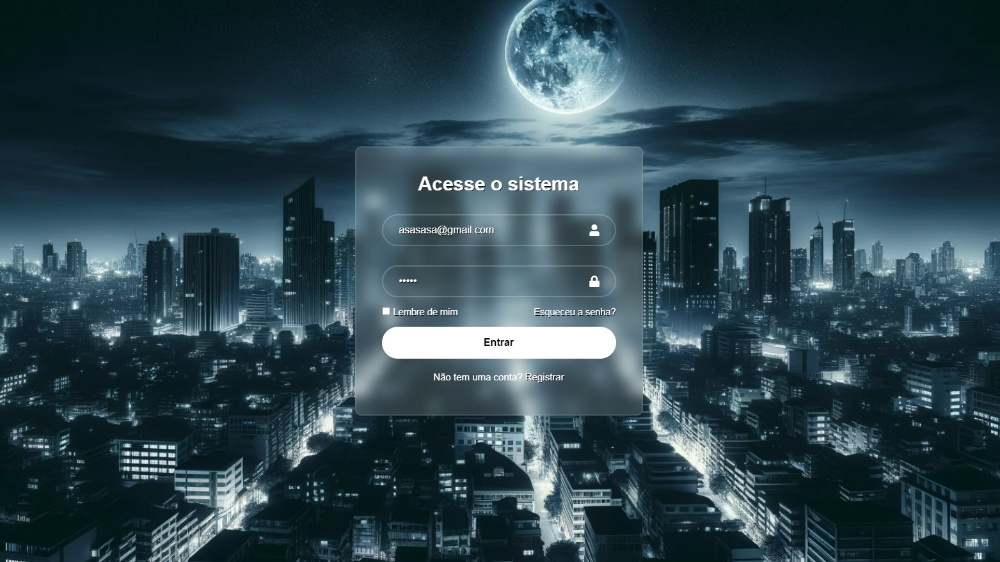

<h1 align="center"> Tela de Login </h1>

Plataforma exclusiva e gratuita, com intuito de simular uma tela de login e seu envio de formulário.  

  <a href="#-tecnologias">Tecnologias</a>&nbsp;&nbsp;&nbsp;|&nbsp;&nbsp;&nbsp;
  <a href="#-projeto">Projeto</a>&nbsp;&nbsp;&nbsp;|&nbsp;&nbsp;&nbsp;
  <!-- <a href="#-layout">Layout</a>&nbsp;&nbsp;&nbsp;|&nbsp;&nbsp;&nbsp; -->
  <!-- <a href="#memo-licença">Licença</a> -->

<!-- 

  

 -->

 

  

## 🚀 Tecnologias

Esse projeto foi desenvolvido com as seguintes tecnologias:

- HTML e CSS
- JavaScript
- React JS + Vite
- Git e Github

## 💻 Projeto

A tela de Login é uma plataforma para simulação de envio de formulário com Email e Senha.

- [Acesse o projeto finalizado, online](https://github.com/igordecastro01/telaLogin-reactjs)

<!-- - [Assistir aulas](https://lp.rocketseat.com.br/devlinks/inscricao?utm_source=github&utm_medium=descricao&utm_campaign=capture-devlinks&utm_term=organic&utm_content=descricao-github-mayk-brito) -->

<!-- ## 🔖 Layout

Você pode visualizar o layout do projeto através [DESSE LINK](https://www.figma.com/community/file/1187422022288947321). É necessário ter conta no [Figma](https://figma.com) para acessá-lo. -->

<!-- ## :memo: Licença

Esse projeto está sob a licença MIT. -->

---

Feito com ♥ by Igor Dutra :wave:
